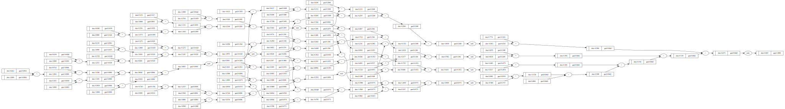

# 基于python的微型自动求导引擎

> [Andrej Karpthy](https://karpathy.ai/) 的自动求导教程([youtube video](https://www.youtube.com/watch?v=VMj-3S1tku0), [github](https://github.com/karpathy/micrograd))

> 用法和demo见 [notebook](./micro_grad.ipynb)

## 1. 核心代码展示
```python
class Value:
    def __init__(self, data, _children=(), _op='', label=''):
        self.data = data
        self.grad = 0.0
        self._backward = lambda: None
        self._prev = set(_children)

    # 定义一组算子
    def __add__(self, other):
        other = other if isinstance(other, Value) else Value(other)
        out = Value(self.data + other.data, (self, other), '+')

        def _backward():
            self.grad += 1.0 * out.grad
            other.grad += 1.0 * out.grad
        out._backward = _backward

        return out

    def exp(self):
        x = self.data
        out = Value(math.exp(x), (self, ), 'exp')

        def _backward():
            self.grad += out.data * out.grad
        out._backward = _backward

        return out

    # 反向传播
    def backward(self):
        topo = []
        visited = set()

        def build_topo(v):
            if v not in visited:
                visited.add(v)
                for child in v._prev:
                    build_topo(child)
                topo.append(v)
        build_topo(self)

        self.grad = 1.0
        for node in reversed(topo):
            node._backward()

```

## 2. 效果图
一个三层（4， 4， 1）的MLP的前向过程和反向求导

